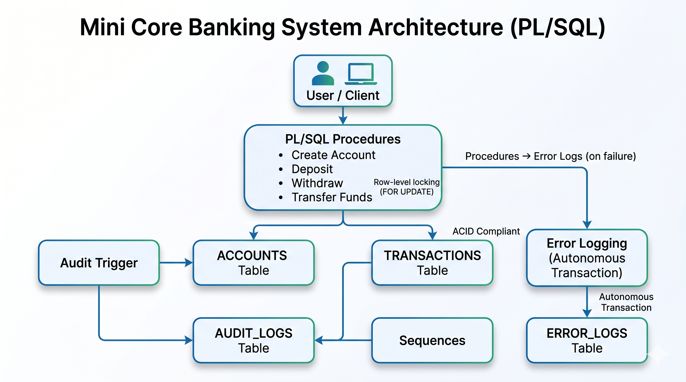

# 🏦 Mini Core Banking System (PL/SQL)

A **production-grade simulation of a Core Banking System** built using Oracle PL/SQL.
This project demonstrates how real banking systems handle **transactions, concurrency, consistency, and failure scenarios** using database-level logic.

---

# 🚀 Project Overview

This system simulates core banking operations such as:

* Account creation
* Deposits & withdrawals
* Fund transfers between accounts
* Transaction tracking
* Audit logging (trigger-based)
* Error logging (autonomous transactions)

The design ensures **ACID-compliant transaction processing** and **data consistency under concurrent operations**.

---

# 🔥 Key Features

## 🏦 Core Banking Operations

* Create account
* Deposit money
* Withdraw money
* Transfer funds

## 🔒 Transaction Safety

* Atomic transactions (commit/rollback)
* Savepoints for partial rollback
* Balance validation

## ⚡ Concurrency Handling

* Row-level locking using `SELECT ... FOR UPDATE`
* Deadlock prevention (ordered locking)
* Safe multi-session execution

## 🧾 Logging & Auditing

* Transaction logs
* Audit logs using triggers
* Error logging using autonomous transactions

## 🧠 Exception Handling

* Business errors (invalid account, insufficient funds)
* System errors
* Structured error propagation

---

# 🧠 Concepts Implemented

* ACID Properties
* PL/SQL Procedures
* Cursors
* Triggers
* Sequences
* Exception Handling
* Row-level Locking
* Savepoints
* Autonomous Transactions (`PRAGMA AUTONOMOUS_TRANSACTION`)

---

# 🏗️ Architecture

## 🔄 System Flow
```



```
User Action
   ↓
PL/SQL Procedure
   ↓
Accounts Table Update
   ↓
Transaction Insert
   ↓
Audit Trigger Fires
   ↓
Audit Logs Stored
   ↓
(If Error) → Error Log Stored
```

---

# 📂 Project Structure

```
mini-core-banking-system/
│
├── README.md
│
├── schema/
│   ├── accounts.sql
│   ├── transactions.sql
│   ├── audit_logs.sql
│   ├── error_logs.sql
│
├── sequences/
│   ├── transaction_seq.sql
│   ├── audit_seq.sql
│   ├── error_seq.sql
│
├── procedures/
│   ├── create_account.sql
│   ├── deposit.sql
│   ├── withdraw.sql
│   ├── transfer_funds.sql
│
├── triggers/
│   ├── audit_trigger.sql
│
├── utils/
│   ├── log_error.sql
│
├── reports/
│   ├── daily_transactions.sql
│   ├── failed_transactions.sql
│   ├── top_accounts.sql
│
├── test_cases/
│   ├── full_system_test.sql
│
└── docs/
    ├── architecture.md

```

---

# 🧪 Test Coverage

## ✅ Normal Scenarios

* Account creation
* Successful transfer
* Deposit & withdrawal

## ❌ Failure Scenarios

* Insufficient balance
* Invalid account
* Same account transfer
* Negative amount

## ⚠️ Edge Cases

* Large transactions
* Zero balance handling

## 🔒 Concurrency Testing

* Multi-session transfers
* Lock handling
* No double spending

---

# 🧪 Sample Test Case

```sql
BEGIN
    transfer_funds(201, 202, 1000);
END;
/
```

### ✔ Expected Result:

* Sender balance decreases
* Receiver balance increases
* Transaction recorded
* Audit log created

---

# 🛠️ How to Run

1. Open Oracle SQL Developer
2. Run scripts in order:

```text
1. schema/
2. sequences/
3. procedures/
4. triggers/
5. utils/
6. test_cases/
```

3. Enable output:

```sql
SET SERVEROUTPUT ON;
```

---

# 🔐 Concurrency Handling (Important)

Transfers use **row-level locking**:

```sql
SELECT * FROM accounts
WHERE account_id = :id
FOR UPDATE;
```

✔ Prevents double spending
✔ Ensures consistency

---

# ⚡ Error Logging (Critical Feature)

Uses:

```sql
PRAGMA AUTONOMOUS_TRANSACTION;
```

✔ Logs errors even if main transaction fails
✔ Ensures no data loss for debugging

---

# 🧾 Audit System

* Trigger-based logging
* Captures:

  * Old balance
  * New balance
  * Timestamp

---

# 🏆 Key Highlights

* Designed like a real banking system
* Handles concurrent transactions safely
* Prevents partial updates using rollback
* Maintains full audit and error traceability

---

# 💡 Real-World Relevance

This system is inspired by real banking platforms like:

* Oracle Flexcube
* Core banking transaction engines

Implements:

* Transaction safety
* Logging
* Compliance-ready architecture

---

# 📈 Future Improvements

* Retry mechanism for failed transactions
* Bulk transaction processing
* Index optimization
* Partitioned tables
* Scheduler jobs for reporting

---


# 👨‍💻 Author

Akshay Kumar

---

# ⭐ If you found this useful

Give a ⭐ on GitHub and share!
