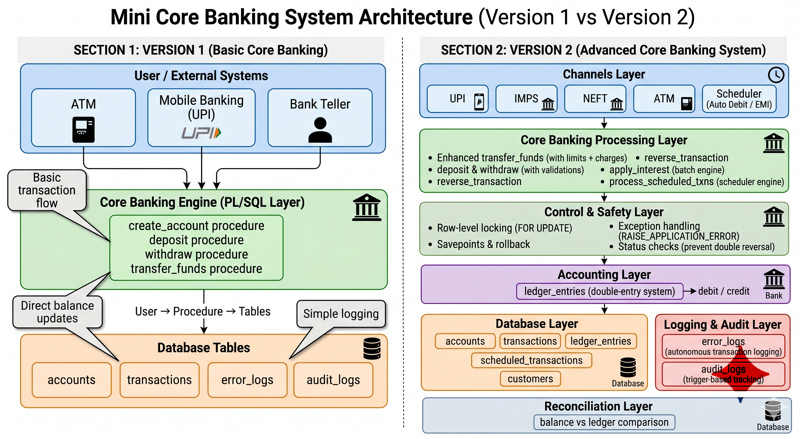

# 🏦 Mini Core Banking Transaction Processing System (V1 + V2)

A **production-grade Core Banking System simulation** built using Oracle PL/SQL.

This project demonstrates how real banking systems handle:

* Transactions
* Concurrency
* Ledger accounting
* Error handling
* Audit tracking
* Scheduled processing

---

# 🎯 PROJECT EVOLUTION

## ✅ Version 1 — Core Banking Basics

Implements fundamental banking operations:

* Account creation
* Deposit & Withdrawal
* Fund Transfer
* Transaction logging
* Basic audit & error logging

👉 Focus: **Transaction correctness + ACID compliance**

---

## 🚀 Version 2 — Enterprise Banking System

Upgrades system to **real-world banking architecture**:

* Customer + Multi-account support
* UPI / IMPS / NEFT simulation
* Charges & fees system
* Ledger-based accounting (double-entry)
* Transaction reversal system
* Interest calculation engine
* Scheduled transactions (EMI / Auto debit)
* Reconciliation system
* Production-grade logging

👉 Focus: **Scalability + Auditability + Financial correctness**

---

# 🧠 KEY CONCEPTS IMPLEMENTED

* ACID Properties
* PL/SQL Procedures
* Row-Level Locking (`FOR UPDATE`)
* Savepoints & Rollback
* Double-entry Ledger System
* Exception Handling (`RAISE_APPLICATION_ERROR`)
* Autonomous Transactions (`PRAGMA AUTONOMOUS_TRANSACTION`)
* Batch Processing (Interest / Scheduler)
* Reconciliation Logic

---

# 🏗️ SYSTEM ARCHITECTURE

## 🔄 Flow Overview



### Flow:

User / Channel (ATM / UPI / Scheduler)
↓
PL/SQL Procedures
↓
Accounts Update
↓
Transactions Table
↓
Ledger Entries (Debit/Credit)
↓
Audit Trigger
↓
Audit Logs

(If failure) → Error Logs (Autonomous Transaction)

---

# 🏦 CORE FEATURES

---

## 💸 1. Account Management

* Create account (linked to customer)
* Opening balance with ledger entry
* Status control (ACTIVE / INACTIVE)

---

## 💰 2. Transactions

* Deposit
* Withdraw
* Transfer (UPI / IMPS / NEFT)

### Safety Features:

* Balance validation
* Same account prevention
* Transaction logging

---

## 🔒 3. Concurrency Control

* Row-level locking (`SELECT ... FOR UPDATE`)
* Ordered locking (deadlock prevention)
* Multi-session safety

✔ Prevents **double spending**

---

## 📘 4. Ledger System (V2 🔥)

* Double-entry accounting
* Debit / Credit entries
* Linked with every transaction

✔ Ensures **financial correctness**

---

## 🔄 5. Transaction Reversal

* Reverse any transaction
* Prevent double reversal
* Status-based control

---

## 💸 6. Charges & Fees

* Channel-based charges:

  * UPI → Free
  * IMPS → Instant charges
  * NEFT → Batch charges

---

## 💰 7. Interest Engine

* Applies monthly interest
* Only for savings accounts
* Batch processing with cursor

---

## 🔁 8. Scheduled Transactions

* EMI / Auto debit system
* Daily / Monthly execution
* Failure handling with logging

---

## 🔍 9. Reconciliation System

* Compares:

  * Account balance
  * Ledger balance

✔ Detects inconsistencies

---

## 🧾 10. Logging & Audit

### Audit Logs

* Trigger-based
* Tracks:

  * Old balance
  * New balance

### Error Logs

* Autonomous transaction
* Captures:

  * Error message
  * Procedure name
  * Reference ID

---

# 📊 REPORTS

* Daily Transactions
* Failed Transactions
* Top Accounts

---

# 📂 PROJECT STRUCTURE

```
mini-core-banking-system/
│
├── docs/
│   ├── architecture.png
│   ├── final_architecture.png
│   ├── project_understanding.pdf
│   ├── Version1.md
│   ├── Version2.md
│
├── schema/
│   ├── accounts.sql
│   ├── customers.sql
│   ├── transactions.sql
│   ├── ledger_entries.sql
│   ├── scheduled_transactions.sql
│   ├── error_logs.sql
│   ├── audit_logs.sql
│   ├── charges.sql
│   ├── transaction_types.sql
│
├── sequences/
│   ├── transactions_seq.sql
│   ├── ledger_seq.sql
│   ├── audit_seq.sql
│   ├── error_seq.sql
│
├── procedures/
│   ├── create_account.sql
│   ├── deposit.sql
│   ├── withdraw.sql
│   ├── transfer_funds.sql
│   ├── reverse_transaction.sql
│   ├── apply_interest.sql
│   ├── process_scheduled_txns.sql
│   ├── reconciliation_system.sql
│
├── triggers/
│   ├── trg_audit_accounts.sql
│
├── utils/
│   ├── log_error.sql
│
├── reports/
│   ├── daily_transactions.sql
│   ├── failed_transactions.sql
│   ├── top_accounts.sql
│
├── indexes/
│   ├── index.sql
│
└── README.md
```

---

# 🧪 TEST COVERAGE

## ✅ Normal Cases

* Account creation
* Deposit / Withdrawal
* Transfer
* Interest application

## ❌ Failure Cases

* Invalid account
* Insufficient balance
* Same account transfer
* Inactive account

## ⚠️ Edge Cases

* Large transactions
* Zero balance
* Multiple scheduled jobs

## 🔒 Concurrency Testing

* Multi-session transfers
* Locking verification
* No double spending

---

# 🛠️ HOW TO RUN

1. Open Oracle SQL Developer

2. Execute scripts in order:

```
1. schema/
2. sequences/
3. indexes/
4. utils/
5. procedures/
6. triggers/
7. reports/
```

3. Enable output:

```sql
SET SERVEROUTPUT ON;
```

---

# 🔐 IMPORTANT DESIGN DECISIONS

---

## 🔒 Why FOR UPDATE?

To prevent:

👉 Multiple users modifying same account simultaneously

---

## 📘 Why Ledger?

To ensure:

👉 Balance can be reconstructed anytime

---

## 🔁 Why Reconciliation?

To detect:

👉 Data inconsistencies

---

## ⚡ Why Autonomous Logging?

To ensure:

👉 Errors are logged even after rollback

---

# 💡 REAL-WORLD INSPIRATION

Inspired by:

* Oracle Flexcube
* Core Banking Transaction Engines

---

# 👨‍💻 AUTHOR

Akshay Kumar

---

# ⭐ SUPPORT

If you found this project useful:

👉 Give a ⭐ on GitHub
👉 Share with others

---
